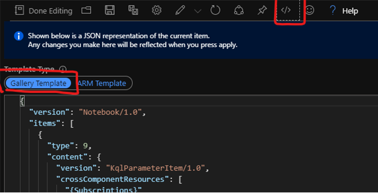

# Azure Firewall Workbook

This is an earlier sample workbook for analyzing Azure Firewall Diagnostics. It
differs from the new workbook and is focused towards troubleshooting packet
flows to determine accuracy of rules.

# Get started

## Prerequisites

Follow the prerequisite guidance in the following article:

- [Monitor logs using Azure Firewall
  Workbook](https://docs.microsoft.com/en-us/azure/firewall/firewall-workbook)

## Install

Create a new Workbook in Azure Monitor and use the Advanced Edditing option to
replace the workbook json with the provided sample.

# Resources

Additional information about monitoring Azure Firewall is available in the
following articles:

- [Monitor Azure Firewall logs and metrics | Microsoft
  Docs](https://docs.microsoft.com/en-us/azure/firewall/firewall-diagnostics)
- [Azure Monitor Workbooks Overview - Azure Monitor | Microsoft
  Docs](https://docs.microsoft.com/en-us/azure/azure-monitor/platform/workbooks-overview)
