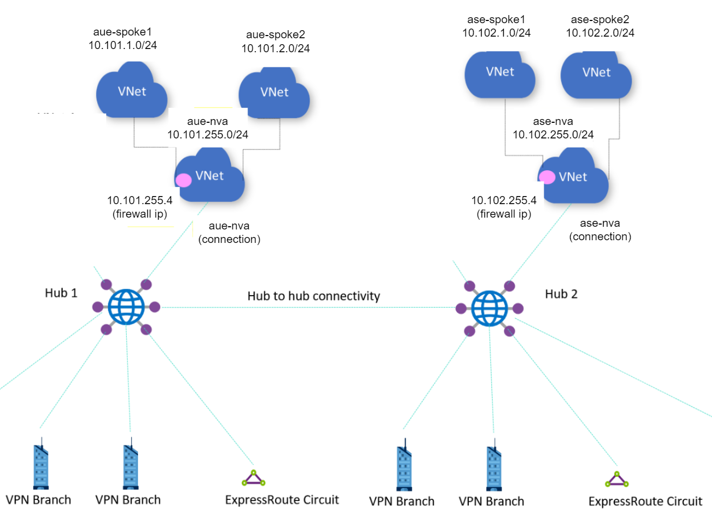

# Sample

## Getting started

This sample uses [Bicep](https://docs.microsoft.com/en-us/azure/azure-resource-manager/bicep/overview) to deploy a specific Virtual WAN topology.



### Install

1. Install the Azure CLI by following the [docs](https://docs.microsoft.com/en-us/cli/azure/install-azure-cli) article.

1. Install Bicep from within the Azure CLI:

```
az bicep install

az bicep upgrade
```

### Login

1. Login and select your subscription

```
az login

az account set --subscription <your_subscription_id>
```

### Deploy

1. Deploy the `main.bicep` file from the `src` directory of this sample:

```
cd deploy_vwan/src/

az deployment sub create --location <your_preferred_location> --template-file .\main.bicep --name vwan --parameters vmusername=localadmin
```

> Note: Type the VM password when prompted. 
